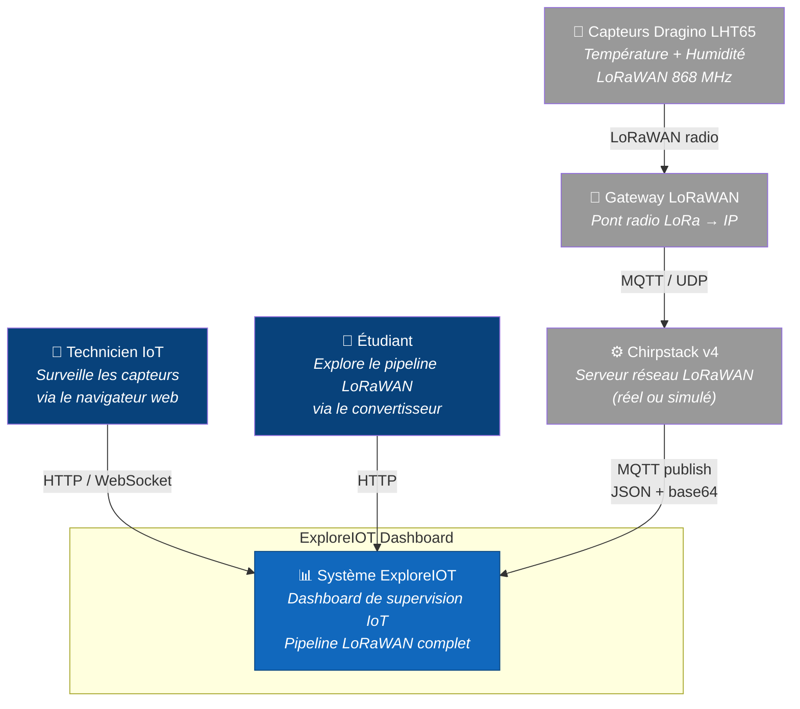
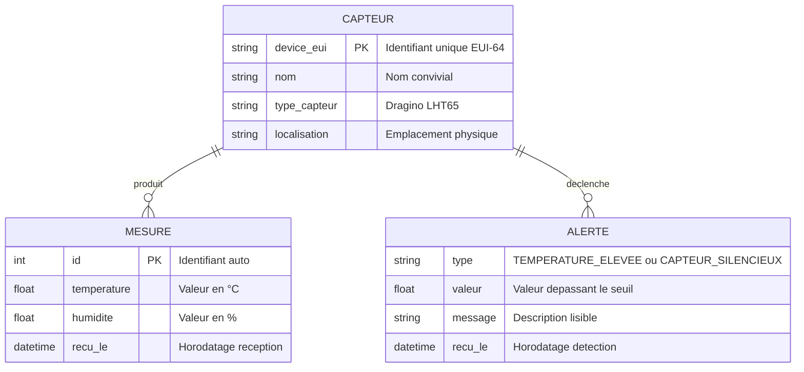

# Arc42 — Section 3 : Contexte système

## 3.1 Contexte métier

ExploreIOT Dashboard s'inscrit dans un réseau IoT LoRaWAN standard. Le système reçoit des trames de capteurs de terrain, les traite, les stocke, et les expose à des opérateurs humains via un dashboard web. Le projet supporte deux modes de fonctionnement :
- **Mode simulation** (par défaut) : l'environnement réseau réel (gateway physique, serveur Chirpstack) est simulé par un worker Python (`publisher.py`) qui publie des mesures réalistes sur le broker MQTT local.
- **Mode production** : Chirpstack v4 est déployé en tant que service Docker réel via le profil Docker Compose `--profile chirpstack`.

!!! warning "Mosquitto et Chirpstack : deux rôles différents"
    Il ne faut pas confondre les deux :

    - **Chirpstack** = le **serveur réseau LoRaWAN**. Il gère le déchiffrement des trames radio, l'authentification des capteurs (OTAA/ABP), et la communication avec les gateways. En sortie, il publie les données décodées sur un broker MQTT.
    - **Mosquitto** = le **broker MQTT**. C'est un simple routeur de messages publish/subscribe. Il ne "comprend" pas LoRaWAN — il transmet les messages d'un producteur vers les consommateurs abonnés.

    **Dans ce projet** : Mosquitto est bien déployé (conteneur Docker). Chirpstack peut être absent (mode simulation, `publisher.py` simule son rôle) ou déployé en tant que service réel (mode production via `docker compose --profile chirpstack up`).

    ```
    Simulation :        publisher.py (simule Chirpstack) → Mosquitto → Subscriber
    Production réelle :  Capteur → Gateway → Chirpstack v4 → Mosquitto → Subscriber
    ```

    !!! note "Chirpstack v4 maintenant disponible"
        Chirpstack v4 est maintenant disponible en tant que profil Docker Compose. Voir section 7.1 pour les instructions de déploiement.

---

## 3.2 Diagramme de contexte C4



### Acteurs

| Acteur | Rôle |
|--------|------|
| **Technicien IoT** | Utilisateur principal — surveille le parc de capteurs, configure les alertes, exporte les données |
| **Étudiant** | Utilisateur pédagogique — explore le convertisseur LoRaWAN pour comprendre l'encodage binaire |

### Systèmes externes

| Système | Description |
|---------|-------------|
| **Capteurs Dragino LHT65** | Capteurs physiques LoRaWAN (simulés par `publisher.py` en développement) |
| **Gateway LoRaWAN** | Pont radio-IP (simulé par `publisher.py` en développement) |
| **Chirpstack v4** | Serveur réseau LoRaWAN — disponible en mode réel via `docker compose --profile chirpstack up` |

---

## 3.3 Acteurs et systèmes externes

### Capteurs Dragino LHT65

Les capteurs **Dragino LHT65** sont des capteurs IoT LoRaWAN commerciaux mesurant la température et l'humidité. Ils encodent leurs mesures dans une trame binaire compacte (payload de quelques octets) et la transmettent via le protocole radio LoRa à longue portée.

Dans ce projet, leur comportement est simulé par `publisher.py`, qui génère des mesures réalistes (via `generer_mesure()`) et les encode au format binaire identique via `app/payload_codec.py` (`struct.pack('>HH', temp*100, hum*10)`).

### Gateway LoRaWAN

La gateway LoRaWAN est le pont radio entre les capteurs (protocole LoRa sur 868 MHz en Europe) et le réseau IP. Elle reçoit les trames radio des capteurs et les transmet au serveur réseau LoRaWAN via MQTT ou UDP.

Dans ce projet, la gateway est simulée — son rôle est intégré dans `publisher.py`.

### Chirpstack v4 : réel ou simulé

**Chirpstack** est le serveur réseau LoRaWAN open source de référence. Il décode les trames LoRaWAN, gère l'authentification des appareils, et publie les données décodées sur un broker MQTT selon un format JSON standardisé.

Le projet supporte deux modes :

**Mode simulation** : Chirpstack est remplacé par `publisher.py`, qui :
1. Génère une mesure aléatoire réaliste
2. L'encode en binaire (`struct.pack`)
3. L'encode en base64 (comme Chirpstack le ferait)
4. Publie le message JSON sur le topic `application/{app_id}/device/{device_id}/event/up`

Ce mode permet de tester le pipeline complet sans infrastructure physique.

**Mode production** : Chirpstack v4 est déployé en tant que service Docker réel via le profil `--profile chirpstack`. Il est alors configuré pour communiquer avec le gateway bridge et publier directement sur Mosquitto.

### Mosquitto — Broker MQTT

**Eclipse Mosquitto** est le broker MQTT open source utilisé comme bus de messages central. Il découple le producteur de données (`publisher.py`) du consommateur (`subscriber.py`). Ce découplage est essentiel : le subscriber peut redémarrer sans perte de message (QoS 1), et de nouveaux consommateurs peuvent s'abonner sans modifier le publisher.

Configuration : port 1883 (MQTT), pas de TLS en développement local.

### Subscriber — Worker Python

Le subscriber est un processus Python autonome qui :
1. S'abonne au topic MQTT `application/+/device/+/event/up`
2. Reçoit chaque message publié par le publisher
3. Décode le payload base64 et binaire
4. Valide les valeurs (plages physiques acceptables)
5. Insère la mesure en base de données via psycopg2
6. Notifie FastAPI via `asyncio.run_coroutine_threadsafe()` pour le broadcast WebSocket

### PostgreSQL

Base de données relationnelle qui stocke :
- Les appareils enregistrés (`devices`)
- Les mesures time-series (`mesures`)
- Les alertes générées (`alerts`)

Le schéma est versionné via **Alembic** pour permettre l'évolution sans perte de données.

### FastAPI — API REST + WebSocket

Le coeur applicatif du backend. Il expose :
- `GET /devices` — liste des appareils
- `GET /devices/{id}/mesures` — historique des mesures avec pagination
- `GET /stats` — statistiques agrégées (min, max, moyenne)
- `GET /alerts` — alertes actives et historique
- `GET /status` — statut détaillé de tous les services (API, DB, MQTT, WS, Publisher)
- `GET /debug/recent-messages` — buffer des 50 derniers messages MQTT bruts
- `WebSocket /ws` — canal temps réel pour le push des nouvelles mesures
- `GET /health` — health check pour Docker et les outils de monitoring

### Dashboard Next.js

L'interface utilisateur construite avec Next.js et Recharts. Elle propose trois vues principales :

- **Dashboard** : supervision temps réel des capteurs (graphiques, statistiques, alertes, export CSV/PDF)
- **Convertisseur** : pipeline d'encodage/décodage LoRaWAN interactif + 4 outils pédagogiques (manipulateur de bits, corruption, overhead, complément à 2)
- **Pipeline** : visualisation animée des 8 étapes du parcours d'une mesure avec 3 modes (live, pas à pas, inspecteur de protocoles)

Fonctionnalités transversales :
- Connexion WebSocket pour recevoir les mesures en temps réel
- Glossaire interactif (15 termes avec tooltips contextuels)
- Panneau de statut des services en mode API (ConnectionStatus)
- Export en CSV et PDF des données affichées
- Toggle Mock/API avec vérification de santé automatique

### Technicien IoT (utilisateur final)

L'opérateur qui utilise le dashboard via son navigateur web. Il consulte l'état des capteurs, vérifie les alertes, et exporte les données pour un rapport ou une analyse externe.

---

## 3.4 Flux de données

| Etape | De | Vers | Protocole | Format |
|-------|----|------|-----------|--------|
| 1 | Capteur Dragino | Gateway | LoRaWAN (radio) | Binaire chiffré |
| 2 | Gateway | Chirpstack | MQTT/UDP | Trame LoRaWAN brute |
| 3 | publisher.py (simule Chirpstack) | Mosquitto | MQTT | JSON avec payload base64 |
| 4 | Mosquitto | Subscriber | MQTT callback | JSON |
| 5 | Subscriber | PostgreSQL | psycopg2 | INSERT SQL |
| 6 | Subscriber | FastAPI | asyncio | Appel coroutine interne |
| 7 | FastAPI | Dashboard | WebSocket | JSON |
| 8 | FastAPI | Dashboard | HTTP REST | JSON |
| 9 | Technicien | Dashboard | HTTP/WS | — |

---

## 3.5 Frontières du système

Le système ExploreIOT Dashboard prend en charge :
- La reception et le stockage des données MQTT
- La persistance et la requête des données historiques
- L'exposition des données via REST et WebSocket
- La détection d'anomalies et la génération d'alertes
- L'affichage temps réel et l'export

Le système ne prend pas en charge :
- La gestion des clés de chiffrement LoRaWAN (Join Server)
- La configuration des gateways physiques
- L'envoi de commandes vers les capteurs (downlink)
- L'authentification multi-utilisateurs (un seul niveau d'accès par clé API)

---

## 3.6 Modèle Conceptuel de Données (MERISE MCD)

Le MCD représente les entités du domaine et leurs associations, indépendamment de toute implémentation technique.



### Entités

| Entité | Description | Identifiant |
|--------|-------------|-------------|
| **CAPTEUR** | Appareil physique IoT LoRaWAN (Dragino LHT65) | `device_eui` (EUI-64, 16 hex) |
| **MESURE** | Relevé de température et humidité à un instant T | `id` (auto-incrémenté) |
| **ALERTE** | Anomalie détectée par analyse des mesures | Composite (`device_eui`, `recu_le`) |

### Associations

| Association | Cardinalité | Description |
|-------------|-------------|-------------|
| CAPTEUR — MESURE | 1,N | Un capteur produit 0 à N mesures |
| CAPTEUR — ALERTE | 1,N | Un capteur déclenche 0 à N alertes |

!!! note "Implémentation actuelle"
    Dans l'implémentation actuelle, l'entité CAPTEUR n'a pas de table dédiée — les capteurs sont identifiés par leur `device_id` dans la table `mesures`. Les noms sont gérés côté frontend (`device-registry.ts`). Les alertes sont calculées dynamiquement à partir des mesures récentes (pas de table `alertes` persistante).
