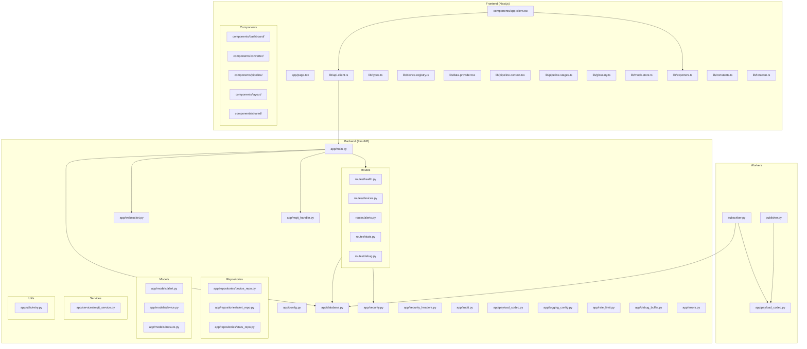
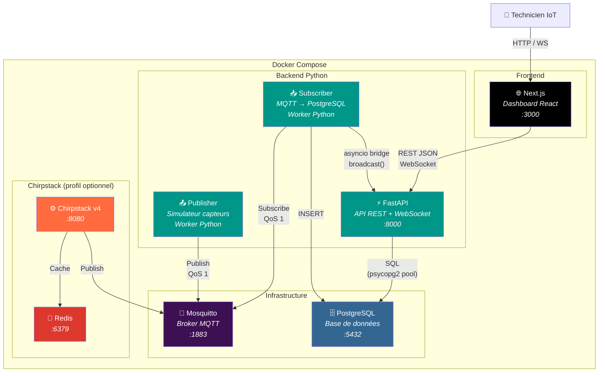
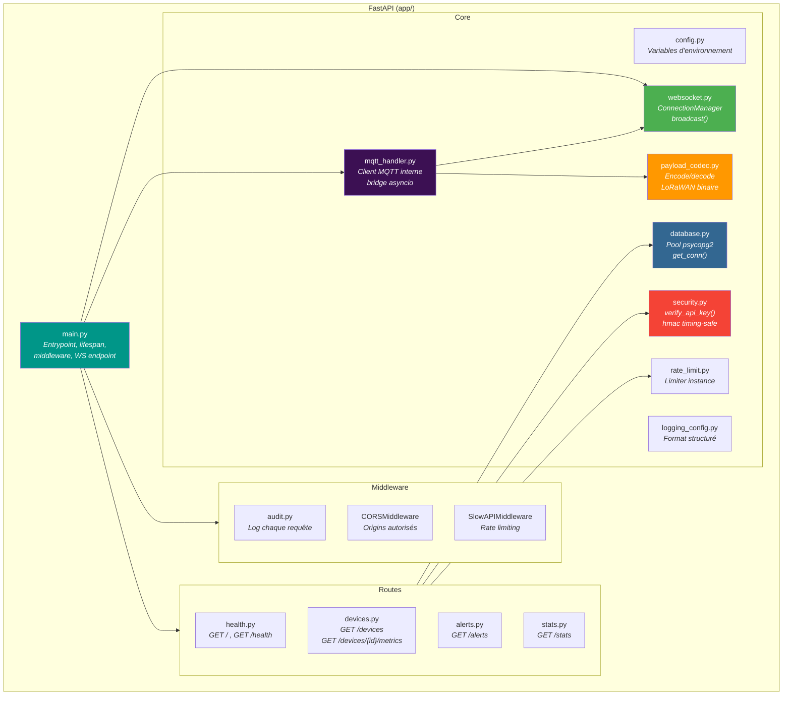
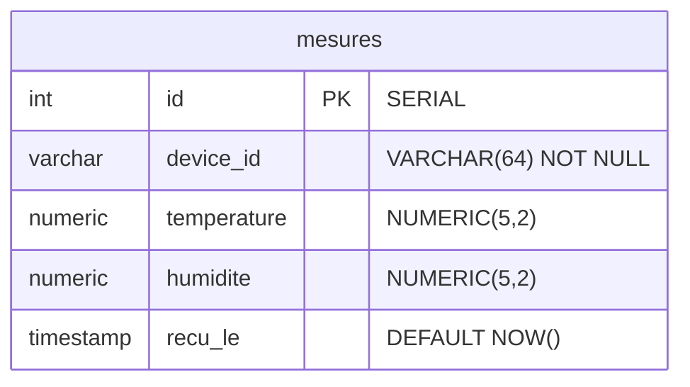

# Arc42 — Section 5 : Décomposition en blocs

## 5.1 Vue d'ensemble des modules



### 5.1.1 Vue Conteneurs C4 (Niveau 2)

Le diagramme de conteneurs C4 détaille les 6 services déployés et leurs protocoles de communication.



#### Catalogue des conteneurs

| Conteneur | Technologie | Port | Rôle |
|-----------|-------------|------|------|
| **Next.js** | React 19, TypeScript | 3000 | Dashboard temps réel + Convertisseur LoRaWAN |
| **FastAPI** | Python, Uvicorn | 8000 | API REST, WebSocket, health check |
| **Subscriber** | Python, paho-mqtt | — | Écoute MQTT, décode, insère en DB |
| **Publisher** | Python, paho-mqtt | — | Simule capteurs Chirpstack v4 |
| **Mosquitto** | Eclipse Mosquitto 2 | 1883 | Broker MQTT publish/subscribe |
| **PostgreSQL** | PostgreSQL 15 | 5432 | Stockage mesures, alertes |
| **Chirpstack** | Chirpstack v4 | 8080 | Serveur réseau LoRaWAN (optionnel) |
| **Redis** | Redis 7 | 6379 | Cache Chirpstack (optionnel) |

---

## 5.2 Modules Frontend

| Module | Chemin | Responsabilité |
|--------|--------|----------------|
| `page.tsx` | `app/page.tsx` | Point d'entrée Next.js — rendu côté serveur minimal, délègue tout au composant client |
| `app-client.tsx` | `components/app-client.tsx` | Composant shell (~19 lignes) — importe NavBar, Dashboard, Converter, Pipeline |
| `types.ts` | `lib/types.ts` | Types partagés — interfaces TypeScript pour Mesure, Device, Alert, Message WebSocket |
| `device-registry.ts` | `lib/device-registry.ts` | Source unique IDs/noms capteurs — liste centralisée des appareils et de leurs identificateurs |
| `data-provider.tsx` | `lib/data-provider.tsx` | React Context Mock/API + WebSocket — fournit les données, gère la connexion, fallback polling |
| `pipeline-context.tsx` | `lib/pipeline-context.tsx` | React Context Pipeline — gère modes (live/step-by-step/inspector), messages, étape active |
| `pipeline-stages.ts` | `lib/pipeline-stages.ts` | 8 définitions d'étapes du pipeline avec description, code, couleur |
| `glossary.ts` | `lib/glossary.ts` | 15 entrées de glossaire IoT/LoRaWAN avec définitions et termes reliés |
| `mock-store.ts` | `lib/mock-store.ts` | Store simulé avec vrais payloads LoRaWAN — données de développement pour les tests sans backend |
| `api-client.ts` | `lib/api-client.ts` | Couche d'accès API — toutes les fonctions `fetch` vers le backend FastAPI et la gestion WebSocket ; isole les détails HTTP du reste du frontend |
| `exporters.ts` | `lib/exporters.ts` | Logique d'export — génération du fichier CSV (Blob + download) et du PDF (via l'API Canvas/print ou une bibliothèque) |
| `constants.ts` | `lib/constants.ts` | Constantes partagées — URLs de l'API, seuils d'alerte, durées de polling, labels d'affichage |
| `lorawan.ts` | `lib/lorawan.ts` | Utilitaires LoRaWAN côté client — fonctions de décodage/formatage des données pour l'affichage (miroir TypeScript du décodage Python) |
| `dashboard/` | `components/dashboard/` | Dashboard, StatsCards, DeviceSelector, MetricsChart, AlertsPanel, ConnectionStatus |
| `converter/` | `components/converter/` | Converter, EncodingPipeline, PipelineStep, DecoderTool, BitManipulator, CorruptionDemo, ProtocolOverhead, NegativeTemperatureDemo |
| `pipeline/` | `components/pipeline/` | Pipeline, PipelineModeTabs, SystemDiagram, DiagramNode, DataPacketAnimation, StageDetailPanel, MessageTimeline, ProtocolInspector, DataTransformPanel, StepByStepControls, StepExplanation |
| `layout/` | `components/layout/` | NavBar, DataModeToggle, NavBtn |
| `shared/` | `components/shared/` | ToastContainer, WsIndicator, HealthIndicator, Skeleton, SectionTitle, Arrow, Row, BinaryDisplay, ConnectionStatus, Term |

### Détail : app-client.tsx

Après la refactorisation Phase 1, c'est un composant shell très léger (~19 lignes) :

```tsx
export default function App() {
  const [view, setView] = useState<View>("dashboard")
  return (
    <div className="min-h-screen bg-gray-950 text-white font-mono">
      <ToastContainer />
      <NavBar view={view} setView={setView} />
      {view === "dashboard" && <Dashboard />}
      {view === "converter" && <Converter />}
      {view === "pipeline" && <Pipeline />}
    </div>
  )
}
```

### Détail : api-client.ts

Ce module suit le pattern **Repository** : il expose des fonctions nommées par domaine métier, pas des appels `fetch` bruts. Exemple :

```typescript
export async function fetchHistory(deviceId: string, limit = 20): Promise<Mesure[]> {
  const data = await apiFetch<{ mesures: Mesure[] }>(
    `/devices/${deviceId}/metrics?limit=${limit}`
  )
  return data.mesures.reverse()
}
```

---

## 5.3 Modules Backend

| Module | Chemin | Responsabilité |
|--------|--------|----------------|
| `main.py` | `app/main.py` | Application FastAPI — point d'entrée Uvicorn, enregistrement des routeurs, middleware CORS, gestion du cycle de vie (startup/shutdown), connexion au broker MQTT au démarrage, WebSocket /ws |
| `config.py` | `app/config.py` | Configuration centralisée — lecture des variables d'environnement via `os.environ.get()` ; constantes importées directement |
| `database.py` | `app/database.py` | Gestion des connexions PostgreSQL — pool de connexions `SimpleConnectionPool`, context manager `get_conn()`, utilitaires de requête |
| `security.py` | `app/security.py` | Authentification par clé API — dependency FastAPI `verify_api_key()`, comparaison timing-safe avec `hmac.compare_digest`, logging des échecs |
| `websocket.py` | `app/websocket.py` | ConnectionManager — gère les connexions WebSocket actives, broadcast avec cap configurable (MAX_WS_CONNECTIONS) |
| `audit.py` | `app/audit.py` | Middleware ASGI — log chaque requête HTTP (méthode, path, status, durée) |
| `payload_codec.py` | `app/payload_codec.py` | Codec LoRaWAN unifié — encode/decode binary payloads, extraction Chirpstack v4, validation device IDs |
| `mqtt_handler.py` | `app/mqtt_handler.py` | Client MQTT FastAPI — gestion de la connexion Mosquitto depuis le contexte de l'application, stockage de la référence à la boucle asyncio pour le bridge WebSocket |
| `rate_limit.py` | `app/rate_limit.py` | Instance `slowapi.Limiter` partagée — importée par les routeurs qui appliquent un décorateur `@limiter.limit()` |
| `logging_config.py` | `app/logging_config.py` | Configuration du logging — initialise le logger racine avec `logging.basicConfig()`, format structuré texte |
| `debug_buffer.py` | `app/debug_buffer.py` | Buffer circulaire thread-safe (deque maxlen=50) pour les messages MQTT de debug |
| `errors.py` | `app/errors.py` | Hiérarchie d'erreurs personnalisées — `AppError`, `NotFoundError`, `ValidationError` + gestionnaire d'exceptions global |
| `security_headers.py` | `app/security_headers.py` | Middleware des en-têtes de sécurité HTTP — `X-Content-Type-Options`, `X-Frame-Options`, `Strict-Transport-Security` |
| `device_repo.py` | `app/repositories/device_repo.py` | Couche d'accès aux données — requêtes centralisées pour les appareils |
| `alert_repo.py` | `app/repositories/alert_repo.py` | Couche d'accès aux données — requêtes centralisées pour les alertes |
| `stats_repo.py` | `app/repositories/stats_repo.py` | Couche d'accès aux données — requêtes centralisées pour les statistiques |
| `alert.py` | `app/models/alert.py` | Modèles de domaine — `AlertType` enum, structure de données Alerte |
| `device.py` | `app/models/device.py` | Modèles de domaine — structure de données Appareil |
| `mesure.py` | `app/models/mesure.py` | Modèles de domaine — structure de données Mesure |
| `mqtt_service.py` | `app/services/mqtt_service.py` | Logique métier — validation des capteurs, orchestration MQTT |
| `retry.py` | `app/utils/retry.py` | Utilitaires partagés — backoff exponentiel, décorateur de retry |

### Détail : security.py

```python
from fastapi import HTTPException, Security
from fastapi.security import APIKeyHeader

api_key_header = APIKeyHeader(name="X-API-Key", auto_error=False)

async def verify_api_key(api_key: str | None = Security(api_key_header)):
    if not API_KEY:
        return
    if api_key is None or not hmac.compare_digest(api_key, API_KEY):
        raise HTTPException(status_code=401, detail="Invalid or missing API key")
```

### Détail : database.py

```python
@contextmanager
def get_conn():
    pool = get_pool()
    conn = pool.getconn()
    try:
        yield conn
    finally:
        pool.putconn(conn)
```

### 5.3.1 Vue Composants C4 (Niveau 3 — FastAPI)

La vue composants C4 détaille l'architecture interne du conteneur FastAPI.



| Composant | Responsabilité principale |
|-----------|--------------------------|
| `main.py` | Point d'entrée Uvicorn, enregistre les routeurs, configure le cycle de vie (MQTT au démarrage), définit l'endpoint WebSocket `/ws` |
| `config.py` | Source unique de configuration via `os.environ.get()` — DB, MQTT, alertes, sécurité, limites |
| `database.py` | Pool de connexions `SimpleConnectionPool` (min 2, max 10), context manager `get_conn()` |
| `security.py` | Dependency FastAPI `verify_api_key()` — comparaison timing-safe `hmac.compare_digest`, retourne 401 |
| `websocket.py` | `ConnectionManager` — cap configurable (`MAX_WS_CONNECTIONS`), broadcast thread-safe avec verrou asyncio |
| `mqtt_handler.py` | Client paho-mqtt dans un thread dédié, valide les plages physiques, bridge vers la boucle asyncio |
| `payload_codec.py` | Codec unifié — `encode_payload()`, `decode_payload()`, `decode_chirpstack_payload()`, `validate_device_id()` |
| `audit.py` | Middleware ASGI — log méthode, path, status code et durée pour chaque requête |

### 5.3.2 Diagramme de classes UML (Backend)

```mermaid
classDiagram
    class ConnectionManager {
        -list~WebSocket~ active_connections
        -int _max_connections
        -asyncio.Lock _lock
        +connect(websocket) bool
        +disconnect(websocket) void
        +broadcast(message) void
    }

    class AuditMiddleware {
        +dispatch(request, call_next) Response
    }

    class AppError {
        -str message
        -int status_code
        +AppError(message, status_code)
    }

    class NotFoundError {
        +NotFoundError(resource)
    }

    class ValidationError {
        +ValidationError(message)
    }

    class SecurityHeadersMiddleware {
        +dispatch(request, call_next) Response
    }

    class SimpleConnectionPool {
        -int minconn
        -int maxconn
        +getconn() connection
        +putconn(conn) void
        +closeall() void
    }

    class Config {
        <<module>>
        +str APP_VERSION
        +str DB_HOST
        +int DB_PORT
        +str MQTT_HOST
        +int MQTT_PORT
        +str MQTT_TOPIC
        +str API_KEY
        +float ALERT_TEMP_THRESHOLD
        +int MAX_WS_CONNECTIONS
        +list DEVICE_EUIS
        +int PUBLISH_INTERVAL
    }

    class PayloadCodec {
        <<module>>
        +encode_payload(temp, hum) str
        +decode_payload(data_b64) dict
        +decode_chirpstack_payload(payload) dict
        +extract_device_id(payload) str
        +validate_device_id(device_id) bool
    }

    class Security {
        <<module>>
        +verify_api_key(api_key) void
    }

    class HealthRouter {
        <<router>>
        +root() dict
        +health_check() dict
    }

    class DevicesRouter {
        <<router>>
        +list_devices() dict
        +device_metrics(device_id, limit) dict
    }

    class AlertsRouter {
        <<router>>
        +get_alerts() dict
    }

    class StatsRouter {
        <<router>>
        +global_stats() dict
    }

    NotFoundError --|> AppError
    ValidationError --|> AppError

    HealthRouter --> SimpleConnectionPool : get_conn()
    DevicesRouter --> SimpleConnectionPool : get_conn()
    DevicesRouter --> Security : verify_api_key
    DevicesRouter --> PayloadCodec : validate_device_id
    AlertsRouter --> SimpleConnectionPool : get_conn()
    AlertsRouter --> Security : verify_api_key
    StatsRouter --> SimpleConnectionPool : get_conn()
    StatsRouter --> Security : verify_api_key
    ConnectionManager --> Config : MAX_WS_CONNECTIONS
```



---

## 5.4 Modules Routes

| Module | Chemin | Endpoints | Responsabilité |
|--------|--------|-----------|----------------|
| `health.py` | `routes/health.py` | `GET /health` | Vérifie la connexion à PostgreSQL avec `SELECT 1` ; renvoie le statut global du service |
| `devices.py` | `routes/devices.py` | `GET /devices`, `GET /devices/{id}/metrics` | CRUD lecture des appareils et consultation des mesures avec pagination |
| `alerts.py` | `routes/alerts.py` | `GET /alerts`, `GET /alerts/active` | Consultation des alertes générées, filtrage par statut et par appareil |
| `stats.py` | `routes/stats.py` | `GET /stats` | Statistiques agrégées (`nb_devices`, `total_mesures`, `temp_moyenne_globale`, `derniere_activite`) |
| `debug.py` | `routes/debug.py` | `GET /debug/recent-messages`, `GET /status` | Endpoints de diagnostic et de statut système détaillé |

**Note :** Le WebSocket `/ws` est défini dans `app/main.py` et utilise la classe `ConnectionManager` de `app/websocket.py`.

---

## 5.5 Workers

| Module | Chemin | Responsabilité |
|--------|--------|----------------|
| `subscriber.py` | `backend/subscriber.py` | Processus autonome — s'abonne au topic MQTT `application/+/device/+/event/up`, décode les payloads Chirpstack v4, insère en base, notifie FastAPI |
| `publisher.py` | `backend/publisher.py` | Processus autonome de simulation — génère des mesures réalistes, les encode en binaire + base64, publie sur MQTT toutes les N secondes, utilise `DEVICE_EUIS` de la config |
| `payload_codec.py` | `app/payload_codec.py` | Codec partagé — encode/decode les payloads binaires LoRaWAN, utilisé par publisher et subscriber |

### Détail : subscriber.py — bridge asyncio

La difficulté principale du subscriber est de notifier FastAPI (qui tourne dans une boucle asyncio) depuis un thread MQTT (synchrone). La solution utilise la classe `ConnectionManager` de `app/websocket.py` :

```python
import asyncio
from app.websocket import manager

# Référence à la boucle asyncio de FastAPI, passée au subscriber au démarrage
_loop: asyncio.AbstractEventLoop = None

def on_message(client, userdata, msg):
    """Callback MQTT — s'exécute dans le thread paho-mqtt, pas dans asyncio."""
    mesure = decode_payload(msg.payload)
    insert_mesure(mesure)  # psycopg2 — synchrone, OK

    # Bridge thread → asyncio
    if _loop and not _loop.is_closed():
        asyncio.run_coroutine_threadsafe(manager.broadcast(mesure), _loop)
```

---

## 5.6 Dépendances inter-modules

| Module source | Module cible | Nature de la dépendance |
|---------------|-------------|------------------------|
| `app-client.tsx` | `api-client.ts` | Import TypeScript — toutes les requêtes HTTP/WS passent par ce module |
| `app-client.tsx` | `exporters.ts` | Import TypeScript — appel lors du clic sur "Exporter CSV/PDF" |
| `pipeline-context.tsx` | `pipeline-stages.ts` | Import TypeScript — charge les définitions des 8 étapes |
| `pipeline-context.tsx` | `data-provider.tsx` | Import TypeScript — accède aux messages WebSocket temps réel |
| `main.py` | `config.py` | Import Python — lecture des settings au démarrage |
| `main.py` | `database.py` | Import Python — initialisation du pool de connexions |
| `main.py` | `mqtt_handler.py` | Import Python — connexion au broker MQTT au démarrage (`on_startup`) |
| `routes/*.py` | `database.py` | Import Python — chaque route utilise `get_conn()` |
| `routes/*.py` | `security.py` | Import Python — dependency injection FastAPI dans les routes protégées |
| `routes/*.py` | `rate_limit.py` | Import Python — décorateur `@limiter.limit()` sur les endpoints publics |
| `debug.py` | `debug_buffer.py` | Import Python — expose le buffer de debug via l'API |
| `subscriber.py` | `database.py` | Import Python — INSERT des mesures |
| `mqtt_handler.py` | `app/websocket.py` | Import Python — appel à `broadcast()` via bridge asyncio |
| `mqtt_handler.py` | `debug_buffer.py` | Import Python — écrit les messages MQTT bruts dans le buffer |

---

## 5.7 Modèle Logique de Données (MERISE MLD)

Le MLD traduit le MCD en structure relationnelle avec les clés primaires, clés étrangères et types de données.

### Schéma relationnel

```text
mesures (
    id          SERIAL       PRIMARY KEY,
    device_id   VARCHAR(64)  NOT NULL,
    temperature NUMERIC(5,2),
    humidite    NUMERIC(5,2),
    recu_le     TIMESTAMP    DEFAULT NOW()
)
```



### Règles de passage MCD → MLD

| Règle | Application |
|-------|-------------|
| Entité → Table | MESURE → `mesures` |
| Identifiant → Clé primaire | `id` SERIAL PRIMARY KEY |
| Association 1,N | `device_id` comme attribut dans `mesures` (pas de table CAPTEUR séparée) |
| Attributs → Colonnes | Typage adapté à PostgreSQL |

### Dépendances fonctionnelles

```text
id → device_id, temperature, humidite, recu_le
```

- La table est en **3ème Forme Normale (3FN)** : chaque attribut non-clé dépend uniquement de la clé primaire.
- `device_id` n'est pas une clé étrangère vers une table `capteurs` (choix de simplification documenté dans le MCD).

### Index

| Nom | Colonnes | Justification |
|-----|----------|---------------|
| `idx_mesures_device_id` | `device_id` | Filtrage par capteur (`GET /devices/{id}/metrics`) |
| `idx_mesures_recu_le` | `recu_le DESC` | Requêtes time-series, tri chronologique |
| `idx_mesures_device_time` | `device_id, recu_le DESC` | Index composite pour les requêtes historiques par capteur |
