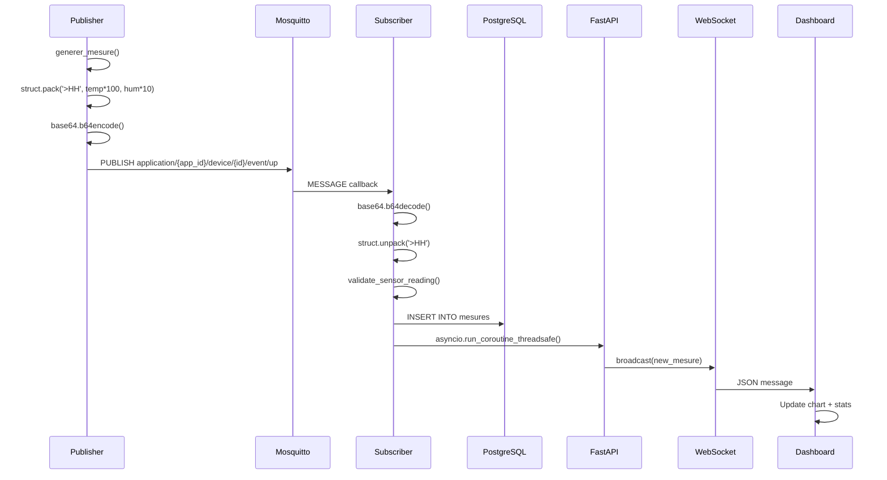
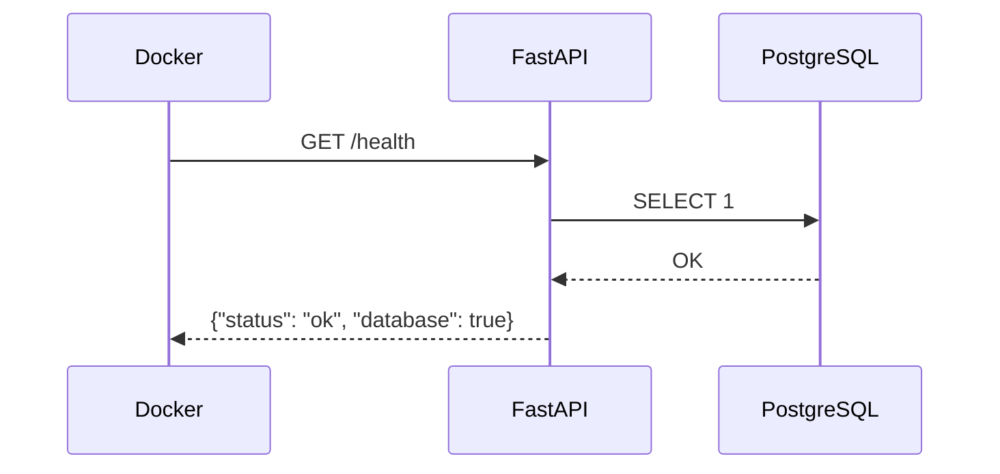

# Arc42 — Section 6 : Vue runtime

La vue runtime décrit le comportement dynamique du système — comment les composants interagissent au moment de l'exécution pour réaliser les cas d'usage principaux.

---

## 6.1 Pipeline MQTT complet — de la mesure au navigateur

Ce diagramme représente le flux nominal complet : une mesure générée par le simulateur arrive dans le navigateur de l'opérateur en moins d'une seconde.



### Explication étape par étape

**Etape 1 — `generer_mesure()` (Publisher)**

Le publisher appelle la fonction `generer_mesure()` définie dans `publisher.py`. Cette fonction produit des valeurs réalistes avec une légère dérive aléatoire pour simuler un capteur physique :

```python
def generer_mesure(device_id: str) -> dict:
    temperature = round(random.uniform(18.0, 35.0), 2)
    humidite = round(random.uniform(30.0, 90.0), 1)
    # ... builds full Chirpstack v4 JSON
```

**Etape 2 — `struct.pack('>HH', temp*100, hum*10)` (Publisher)**

La mesure est encodée en binaire pour simuler le format LoRaWAN réel. La multiplication par 100 (température) et 10 (humidité) permet de conserver la précision décimale dans un entier non signé de 2 octets (`unsigned short`) :

- `23.45°C × 100 = 2345` → encodé en 2 octets big-endian : `0x09 0x29`
- `61.2% × 10 = 612` → encodé en 2 octets big-endian : `0x02 0x64`

Résultat : 4 octets compacts, contre ~35 octets pour le JSON équivalent.

**Etape 3 — `base64.b64encode()` (Publisher)**

Le payload binaire est encodé en base64 pour être transportable dans le champ JSON `data` du message MQTT. C'est exactement ce que Chirpstack fait dans un réseau LoRaWAN réel :

```json
{
  "device_id": "dragino-001",
  "data": "CSkyZA==",
  "timestamp": "2026-04-11T10:23:45Z"
}
```

**Etape 4 — `PUBLISH application/{app_id}/device/{id}/event/up` (Publisher → Mosquitto)**

Le message JSON est publié sur le topic MQTT avec QoS 1 (at least once). Mosquitto l'enregistre et le transmet immédiatement à tous les abonnés du topic `application/+/device/+/event/up`.

**Etape 5 — `MESSAGE callback` (Mosquitto → Subscriber)**

Le subscriber est abonné au topic `application/+/device/+/event/up` (le `+` est un wildcard qui capture n'importe quel `device_id`). La bibliothèque `paho-mqtt` appelle la fonction `on_message()` dans son thread dédié.

**Etape 6 — `base64.b64decode()` (Subscriber)**

Le subscriber extrait le champ `data` du JSON et le décode de base64 vers les octets bruts :

```python
payload_bytes = base64.b64decode(message_json["data"])
# Résultat : b'\x09\x29\x02\x64'
```

**Etape 7 — `struct.unpack('>HH')` (Subscriber)**

Les 4 octets sont décodés en deux entiers big-endian, puis convertis en valeurs flottantes :

```python
temp_int, hum_int = struct.unpack('>HH', payload_bytes)
temperature = temp_int / 100.0   # 2345 → 23.45
humidite = hum_int / 10.0        # 612 → 61.2
```

**Etape 8 — `validate_sensor_reading()` (Subscriber)**

Les valeurs décodées sont validées contre des plages physiques acceptables avant insertion. Cette étape rejette les mesures corrompues ou hors-plage :

```python
def validate_sensor_reading(temperature: float, humidite: float) -> bool:
    if not (-40.0 <= temperature <= 85.0):   # plage physique LHT65
        return False
    if not (0.0 <= humidite <= 100.0):
        return False
    return True
```

**Etape 9 — `INSERT INTO mesures` (Subscriber → PostgreSQL)**

Si la validation passe, la mesure est insérée en base avec psycopg2. L'INSERT est synchrone et se termine en quelques millisecondes sur une base locale :

```sql
INSERT INTO mesures (device_id, temperature, humidite, received_at)
VALUES (%s, %s, %s, NOW())
```

**Etape 10 — `asyncio.run_coroutine_threadsafe()` (Subscriber → FastAPI)**

Immédiatement après l'INSERT, le subscriber notifie FastAPI. Comme le callback MQTT s'exécute dans un thread synchrone (thread paho-mqtt) et que FastAPI tourne dans une boucle asyncio, le bridge est nécessaire :

```python
future = asyncio.run_coroutine_threadsafe(
    broadcast({"temperature": temperature, "humidite": humidite, "device_id": device_id}),
    loop  # boucle asyncio de FastAPI
)
```

**Etape 11 — `broadcast(new_mesure)` (FastAPI → WebSocket)**

FastAPI itère sur l'ensemble des connexions WebSocket actives et envoie le message JSON à chacune. Les connexions fermées sont retirées de l'ensemble :

```python
async def broadcast(message: dict):
    for ws in active_connections.copy():
        try:
            await ws.send_json(message)
        except Exception:
            active_connections.discard(ws)
```

**Etape 12 — `JSON message` (WebSocket → Dashboard)**

Le navigateur reçoit le message JSON via l'API WebSocket native. L'handler `onmessage` est appelé avec l'événement.

**Etape 13 — `Update chart + stats` (Dashboard)**

Le composant React met à jour son état interne avec la nouvelle mesure. Recharts redessine le graphique avec la nouvelle série de données. L'affichage est mis à jour sans rechargement de page. La latence totale de l'étape 4 à l'étape 13 est inférieure à 500 ms en conditions normales.

---

## 6.2 Health check Docker

Ce diagramme représente le flux du health check utilisé par Docker Compose pour vérifier que le backend est opérationnel et connecté à la base de données.



### Explication du health check

**Pourquoi un health check ?**

Docker Compose marque un service comme "healthy" ou "unhealthy" selon le résultat du health check. Les services qui dépendent du backend (ex. un futur proxy Nginx) peuvent attendre que le backend soit `healthy` avant de démarrer, grâce à `depends_on: condition: service_healthy`.

**Implémentation**

```python
# routes/health.py
@router.get("/health")
async def health_check():
    db_ok = False
    try:
        with get_db_connection() as conn:
            cursor = conn.cursor()
            cursor.execute("SELECT 1")
            db_ok = True
    except Exception as e:
        logger.error("health_check_db_failed", error=str(e))

    status = "ok" if db_ok else "degraded"
    return {"status": status, "database": db_ok}
```

**Configuration Docker Compose**

```yaml
healthcheck:
  test: ["CMD", "curl", "-f", "http://localhost:8000/health"]
  interval: 30s
  timeout: 10s
  retries: 3
  start_period: 40s
```

Le `start_period` de 40 secondes laisse le temps à PostgreSQL de démarrer et aux migrations Alembic de s'exécuter avant que Docker ne considère les échecs comme des erreurs.

---

## 6.3 Scénario d'erreur — Perte de connexion WebSocket

En cas de déconnexion WebSocket (restart du backend, coupure réseau), le dashboard bascule sur le mode polling :

```text
WebSocket.onclose →
    setInterval(pollMesures, 5000) →
        GET /devices/{id}/mesures →
            Mise à jour manuelle du graphique
WebSocket reconnect attempt after 3s →
    if success: clearInterval(pollInterval)
```

Ce mécanisme garantit la continuité de l'affichage même en cas d'instabilité réseau, avec une dégradation gracieuse (polling toutes les 5s au lieu du push instantané).

---

## 6.4 Pipeline interactif — modes de visualisation

Le frontend offre une vue Pipeline avec trois modes d'interaction pour explorer le flux de données :

### Mode Live

En mode live, le système génère automatiquement des mesures simulées toutes les 5 secondes. Chaque mesure traverse les 8 étapes du pipeline avec une animation visuelle :

```text
[Capteur] → [LoRaWAN] → [MQTT] → [Subscriber] → [PostgreSQL] → [API] → [WebSocket] → [Navigateur]
```

L'utilisateur peut cliquer sur n'importe quelle étape pour voir les données à ce stade (valeur brute, encodée, JSON, etc.) et le snippet de code correspondant.

### Mode Pas à pas

Permet de contrôler manuellement la progression d'une mesure à travers le pipeline :

1. **Générer** — Crée une nouvelle mesure avec des valeurs aléatoires
2. **Suivant** — Avance d'une étape avec explication pédagogique
3. **Reset** — Remet le pipeline à zéro

Chaque étape affiche une explication détaillée de la transformation effectuée (encodage binaire, Base64, JSON, etc.).

### Mode Inspecteur de protocoles

Affiche les trames brutes des trois protocoles de communication :

- **Onglet MQTT** — Messages MQTT avec payloads Chirpstack v4 complets (deduplicationId, deviceInfo, rxInfo, txInfo)
- **Onglet WebSocket** — Frames WebSocket (new_mesure, debug_mqtt, ping/pong)
- **Onglet HTTP** — Requêtes/réponses REST (GET /stats, /devices, /alerts)

En mode Mock, les données sont dérivées des messages du pipeline pour fonctionner sans backend.
