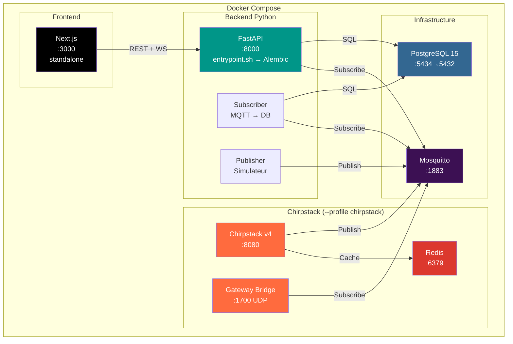

# Section 7 — Vue déploiement

## 7.1 Vue d'ensemble

Le système ExploreIOT est intégralement conteneurisé via Docker Compose. L'ensemble des services (base de données, broker MQTT, API, abonné MQTT, simulateur et frontend) est déclaré dans un fichier `docker-compose.yml` unique, ce qui garantit un démarrage reproductible sur n'importe quelle machine disposant de Docker.

**Docker Compose profiles** permettent de séparer les deux modes de fonctionnement :

- **Mode simulation** (défaut) : `docker compose up` — démarre les services de base (PostgreSQL, Mosquitto, FastAPI, Subscriber, Publisher, Frontend). Publisher.py simule Chirpstack.
- **Mode production** : `docker compose --profile chirpstack up` — active le profil `chirpstack`, qui ajoute Chirpstack v4, le gateway bridge et Redis aux services de base.

## 7.2 Diagramme de déploiement



## 7.3 Catalogue des services

| Service | Image | Ports exposés | Healthcheck | Dépendances | Profil |
|---------|-------|---------------|-------------|-------------|--------|
| `postgres` | `postgres:15-alpine` | `5434:5432` | `pg_isready -U ${POSTGRES_USER}` | — | — |
| `mosquitto` | `eclipse-mosquitto:2` | `1883:1883` | TCP port 1883 | — | — |
| `api` | `backend` (build local) | `8000:8000` | `GET /health` HTTP 200 | `postgres`, `mosquitto` | — |
| `subscriber` | `backend` (build local) | — | — | `postgres`, `mosquitto` | — |
| `publisher` | `backend` (build local) | — | — | `mosquitto` | — |
| `frontend` | `frontend` (build local) | `3000:3000` | `GET /` HTTP 200 | `api` | — |
| `redis` | `redis:7-alpine` | — | `redis-cli ping` | — | Profile `chirpstack` |
| `chirpstack` | `chirpstack/chirpstack:4` | `8080:8080` | — | `postgres`, `redis`, `mosquitto` | Profile `chirpstack` |
| `chirpstack-gateway-bridge` | `chirpstack/chirpstack-gateway-bridge:4` | `1700:1700/udp` | — | `mosquitto` | Profile `chirpstack` |

## 7.4 Ordre de démarrage

Docker Compose respecte les déclarations `depends_on` avec condition `service_healthy` pour les services critiques. L'ordre effectif est le suivant :

1. **`postgres`** — démarre en premier. Le healthcheck `pg_isready` doit passer avant que les services dépendants ne soient lancés.
2. **`mosquitto`** — démarre en parallèle de `postgres`. Le healthcheck vérifie que le port 1883 est accessible.
3. **`api`** — attend que `postgres` et `mosquitto` soient sains. Au démarrage, `entrypoint.sh` exécute les migrations Alembic avant de lancer Uvicorn.
4. **`subscriber`** — attend que `postgres` et `mosquitto` soient sains. Se connecte au broker MQTT et inscrit les mesures en base.
5. **`publisher`** — attend uniquement que `mosquitto` soit sain. Publie des données simulées sur le topic MQTT configuré.
6. **`frontend`** — attend que `api` soit sain. Sert l'application Next.js en mode standalone.

## 7.5 Stratégie des entrypoints

### Service `api`

Le service `api` utilise un script `entrypoint.sh` qui s'exécute avant le serveur applicatif :

```bash
#!/bin/sh
set -e
echo "Running Alembic migrations..."
alembic upgrade head
echo "Starting Uvicorn..."
exec uvicorn app.main:app --host 0.0.0.0 --port 8000
```

Cette approche garantit que le schéma de base de données est toujours à jour avant que l'API n'accepte des requêtes, sans nécessiter d'étape manuelle.

### Services `subscriber` et `publisher`

Ces deux services partagent la même image Docker que l'API mais **contournent** l'entrypoint par défaut grâce à la directive :

```yaml
entrypoint: []
command: python -m app.mqtt_subscriber  # ou mqtt_publisher
```

Cela leur permet de démarrer directement leur script Python sans relancer les migrations Alembic, évitant ainsi des conflits ou des ralentissements inutiles.

## 7.6 Persistance des données

Un volume nommé `postgres_data` est déclaré au niveau racine du fichier Compose et monté dans le conteneur PostgreSQL :

```yaml
volumes:
  postgres_data:

services:
  postgres:
    volumes:
      - postgres_data:/var/lib/postgresql/data
```

Ce volume survit aux redémarrages et aux recréations de conteneurs (`docker compose down`). Il est supprimé uniquement avec `docker compose down -v`.

La configuration Mosquitto (fichier `mosquitto.conf`) est montée en lecture seule via un bind mount depuis le répertoire `docker/mosquitto/` du dépôt.

## 7.7 Variables d'environnement

Toutes les valeurs sensibles et configurables sont externalisées dans un fichier `.env` (non versionné) dont `.env.example` constitue la référence. Les variables principales sont :

| Variable | Usage |
|----------|-------|
| `POSTGRES_USER` | Nom d'utilisateur PostgreSQL |
| `POSTGRES_PASSWORD` | Mot de passe PostgreSQL |
| `POSTGRES_DB` | Nom de la base de données |
| `DATABASE_URL` | URL de connexion complète pour l'API et le subscriber |
| `MQTT_BROKER_HOST` | Nom d'hôte du broker Mosquitto (nom de service Docker) |
| `MQTT_TOPIC` | Topic MQTT d'écoute (ex : `application/+/device/+/event/up`) |
| `API_KEY` | Clé d'authentification pour les endpoints protégés |
| `CORS_ORIGINS` | Origines autorisées pour CORS |
| `RATE_LIMIT_DEFAULT` | Limite de requêtes par minute par IP |

## 7.8 Lancement rapide avec demo.sh

Pour le développement et les démonstrations, le script `demo.sh` à la racine du projet offre une alternative au déploiement Docker complet. Il lance uniquement l'infrastructure nécessaire (PostgreSQL + Mosquitto via Docker) et exécute l'API et le publisher localement pour un démarrage plus rapide et des logs directement visibles dans le terminal.

```bash
./demo.sh
```

**Fonctionnement :**

1. Vérifie que Docker est disponible
2. Lance `docker compose up -d postgres mosquitto`
3. Attend que les services soient healthy
4. Lance l'API FastAPI localement : `uvicorn app.main:app --port 8000`
5. Lance le publisher localement : `python publisher.py`
6. Affiche un récapitulatif avec les URLs
7. Trap SIGINT/SIGTERM pour tout nettoyer proprement (kill processes + docker compose down)

**Avantages par rapport au Docker complet :**

- Démarrage en ~10 secondes (vs ~30s pour le build Docker complet)
- Logs directement dans le terminal (pas besoin de `docker compose logs`)
- Pas de rebuild d'image nécessaire après modification du code
- Idéal pour les présentations et soutenances

---

## 7.9 Modèle Physique de Données (MERISE MPD)

Le MPD correspond au DDL SQL exact déployé sur PostgreSQL 15 via Alembic.

### DDL PostgreSQL

```sql
-- Migration initiale (Alembic)
CREATE TABLE mesures (
    id          SERIAL          PRIMARY KEY,
    device_id   VARCHAR(64)     NOT NULL,
    temperature NUMERIC(5, 2),
    humidite    NUMERIC(5, 2),
    recu_le     TIMESTAMP       NOT NULL DEFAULT NOW()
);

-- Index de performance
CREATE INDEX idx_mesures_device_id
    ON mesures (device_id);

CREATE INDEX idx_mesures_recu_le
    ON mesures (recu_le DESC);

CREATE INDEX idx_mesures_device_time
    ON mesures (device_id, recu_le DESC);
```

### Volumétrie estimée

| Paramètre | Valeur |
|-----------|--------|
| Capteurs simultanés | 3 (simulation), extensible |
| Intervalle de publication | 5 secondes par capteur |
| Mesures par heure | ~2 160 (3 × 12 × 60) |
| Mesures par jour | ~51 840 |
| Taille par ligne | ~80 octets |
| Stockage par jour | ~4 Mo |

### Requêtes principales

**Liste des capteurs avec stats 24h :**

```sql
SELECT
    device_id,
    COUNT(*) AS nb_mesures,
    ROUND(AVG(temperature)::numeric, 2) AS temp_moyenne,
    ROUND(MIN(temperature)::numeric, 2) AS temp_min,
    ROUND(MAX(temperature)::numeric, 2) AS temp_max,
    MAX(recu_le) AS derniere_mesure
FROM mesures
WHERE recu_le > NOW() - INTERVAL '24 hours'
GROUP BY device_id
ORDER BY device_id;
```

**Statistiques globales :**

```sql
SELECT
    COUNT(DISTINCT device_id) AS nb_devices,
    COUNT(*) AS total_mesures,
    ROUND(AVG(temperature)::numeric, 2) AS temp_moyenne_globale,
    MAX(recu_le) AS derniere_activite
FROM mesures;
```

**Historique capteur (paginé) :**

```sql
SELECT id, device_id, temperature, humidite, recu_le
FROM mesures
WHERE device_id = $1
ORDER BY recu_le DESC
LIMIT $2;
```

### Gestion des migrations

Le schéma est versionné par **Alembic** :

```bash
# Appliquer toutes les migrations
alembic upgrade head

# Créer une nouvelle migration
alembic revision -m "add_column_x"

# Rollback d'une migration
alembic downgrade -1
```

Le conteneur Docker `api` exécute `alembic upgrade head` automatiquement au démarrage via `entrypoint.sh`.
