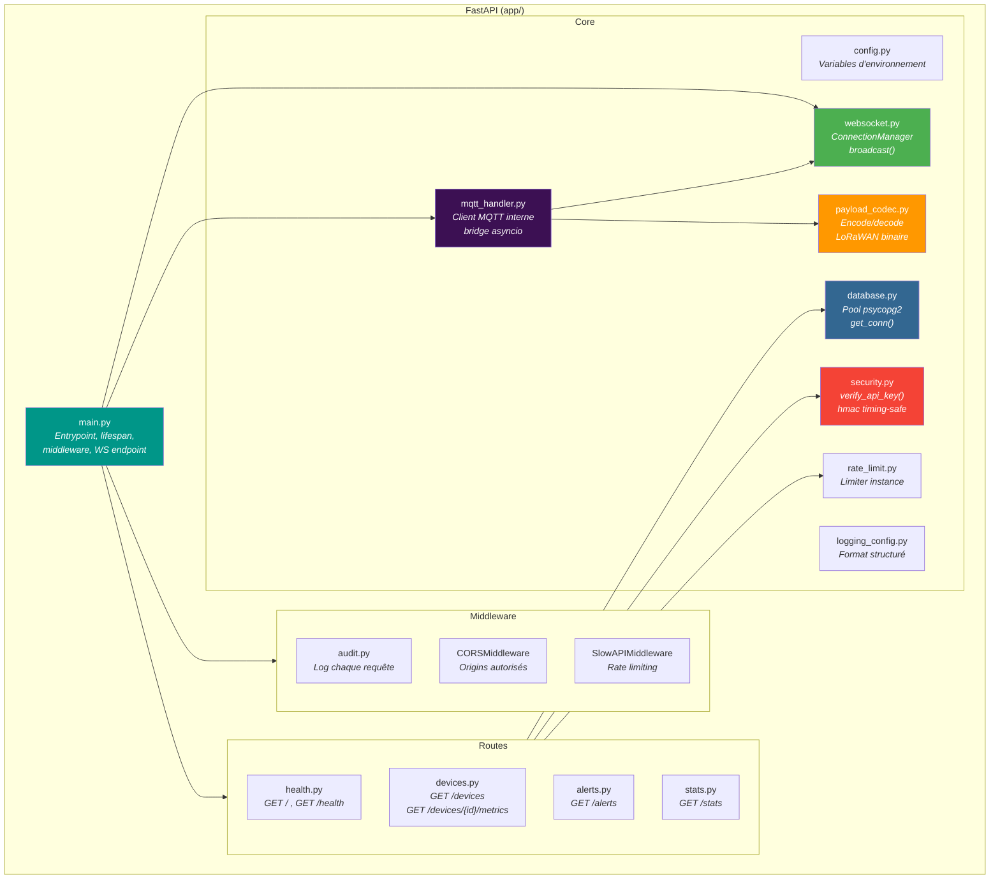

# Diagramme C4 — Niveau 3 : Composants FastAPI

Vue détaillée des composants internes du conteneur FastAPI.

## Responsabilités

| Composant | Responsabilité principale |
|-----------|--------------------------|
| `main.py` | Point d'entrée Uvicorn, enregistre les routeurs, configure le cycle de vie (MQTT au démarrage), définit l'endpoint WebSocket `/ws` |
| `config.py` | Source unique de configuration via `os.environ.get()` — DB, MQTT, alertes, sécurité, limites |
| `database.py` | Pool de connexions `SimpleConnectionPool` (min 2, max 10), context manager `get_conn()` |
| `security.py` | Dependency FastAPI `verify_api_key()` — comparaison timing-safe `hmac.compare_digest`, retourne 401 |
| `websocket.py` | `ConnectionManager` — cap configurable (`MAX_WS_CONNECTIONS`), broadcast thread-safe avec verrou asyncio |
| `mqtt_handler.py` | Client paho-mqtt dans un thread dédié, valide les plages physiques, bridge vers la boucle asyncio |
| `payload_codec.py` | Codec unifié — `encode_payload()`, `decode_payload()`, `decode_chirpstack_payload()`, `validate_device_id()` |
| `audit.py` | Middleware ASGI — log méthode, path, status code et durée pour chaque requête |
