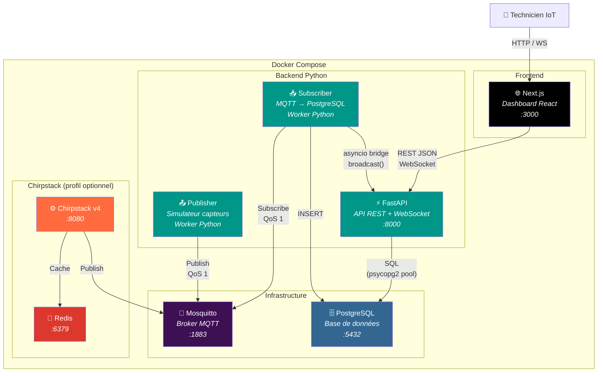

# Diagramme C4 — Niveau 2 : Conteneurs

Le diagramme de conteneurs montre les 6 services déployés et leurs protocoles de communication.

## Catalogue des conteneurs

| Conteneur | Technologie | Port | Rôle |
|-----------|-------------|------|------|
| **Next.js** | React 19, TypeScript | 3000 | Dashboard temps réel + Convertisseur LoRaWAN |
| **FastAPI** | Python, Uvicorn | 8000 | API REST, WebSocket, health check |
| **Subscriber** | Python, paho-mqtt | — | Écoute MQTT, décode, insère en DB |
| **Publisher** | Python, paho-mqtt | — | Simule capteurs Chirpstack v4 |
| **Mosquitto** | Eclipse Mosquitto 2 | 1883 | Broker MQTT publish/subscribe |
| **PostgreSQL** | PostgreSQL 15 | 5432 | Stockage mesures, alertes |
| **Chirpstack** | Chirpstack v4 | 8080 | Serveur réseau LoRaWAN (optionnel) |
| **Redis** | Redis 7 | 6379 | Cache Chirpstack (optionnel) |
