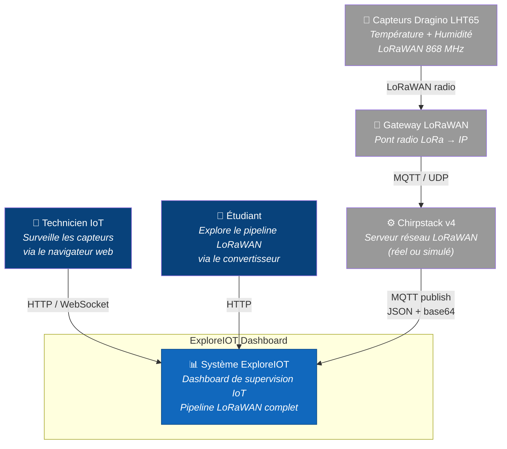

# Diagramme C4 ��� Niveau 1 : Contexte système

Le diagramme de contexte montre ExploreIOT dans son environnement, avec les acteurs et systèmes externes.

## Acteurs

| Acteur | Rôle |
|--------|------|
| **Technicien IoT** | Utilisateur principal — surveille le parc de capteurs, configure les alertes, exporte les données |
| **Étudiant** | Utilisateur pédagogique — explore le convertisseur LoRaWAN pour comprendre l'encodage binaire |

## Systèmes externes

| Système | Description |
|---------|-------------|
| **Capteurs Dragino LHT65** | Capteurs physiques LoRaWAN (simulés par `publisher.py` en développement) |
| **Gateway LoRaWAN** | Pont radio-IP (simulé par `publisher.py` en développement) |
| **Chirpstack v4** | Serveur réseau LoRaWAN — disponible en mode réel via `docker compose --profile chirpstack up` |
