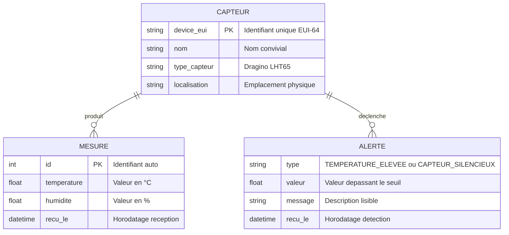

# MERISE — Modèle Conceptuel de Données (MCD)

Le MCD représente les entités du domaine et leurs associations, indépendamment de toute implémentation technique.

## Entités

| Entité | Description | Identifiant |
|--------|-------------|-------------|
| **CAPTEUR** | Appareil physique IoT LoRaWAN (Dragino LHT65) | `device_eui` (EUI-64, 16 hex) |
| **MESURE** | Relevé de température et humidité à un instant T | `id` (auto-incrémenté) |
| **ALERTE** | Anomalie détectée par analyse des mesures | Composite (`device_eui`, `recu_le`) |

## Associations

| Association | Cardinalité | Description |
|-------------|-------------|-------------|
| CAPTEUR — MESURE | 1,N | Un capteur produit 0 à N mesures |
| CAPTEUR — ALERTE | 1,N | Un capteur déclenche 0 à N alertes |

## Notes

- Dans l'implémentation actuelle, l'entité CAPTEUR n'a pas de table dédiée — les capteurs sont identifiés par leur `device_id` dans la table `mesures`. Les noms sont gérés côté frontend (`device-registry.ts`).
- Les alertes sont calculées dynamiquement à partir des mesures récentes (pas de table `alertes` persistante).
