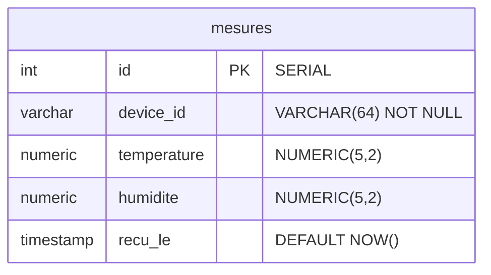

# MERISE — Modèle Logique de Données (MLD)

Le MLD traduit le MCD en structure relationnelle avec les clés primaires, clés étrangères et types de données.

## Schéma relationnel

```text
mesures (
    id          SERIAL       PRIMARY KEY,
    device_id   VARCHAR(64)  NOT NULL,
    temperature NUMERIC(5,2),
    humidite    NUMERIC(5,2),
    recu_le     TIMESTAMP    DEFAULT NOW()
)
```



## Règles de passage MCD → MLD

| Règle | Application |
|-------|-------------|
| Entité → Table | MESURE → `mesures` |
| Identifiant → Clé primaire | `id` SERIAL PRIMARY KEY |
| Association 1,N | `device_id` comme attribut dans `mesures` (pas de table CAPTEUR séparée) |
| Attributs → Colonnes | Typage adapté à PostgreSQL |

## Dépendances fonctionnelles

```text
id → device_id, temperature, humidite, recu_le
```

- La table est en **3ème Forme Normale (3FN)** : chaque attribut non-clé dépend uniquement de la clé primaire.
- `device_id` n'est pas une clé étrangère vers une table `capteurs` (choix de simplification documenté dans le MCD).

## Index

| Nom | Colonnes | Justification |
|-----|----------|---------------|
| `idx_mesures_device_id` | `device_id` | Filtrage par capteur (`GET /devices/{id}/metrics`) |
| `idx_mesures_recu_le` | `recu_le DESC` | Requêtes time-series, tri chronologique |
| `idx_mesures_device_time` | `device_id, recu_le DESC` | Index composite pour les requêtes historiques par capteur |
