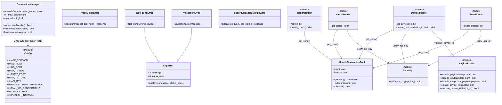

# Diagramme UML — Classes Backend

Diagramme de classes des modules principaux du backend FastAPI.

```mermaid
classDiagram
    class ConnectionManager {
        -list~WebSocket~ active_connections
        -int _max_connections
        -asyncio.Lock _lock
        +connect(websocket) bool
        +disconnect(websocket) void
        +broadcast(message) void
    }

    class AuditMiddleware {
        +dispatch(request, call_next) Response
    }

    class AppError {
        -str message
        -int status_code
        +AppError(message, status_code)
    }

    class NotFoundError {
        +NotFoundError(resource)
    }

    class ValidationError {
        +ValidationError(message)
    }

    class SecurityHeadersMiddleware {
        +dispatch(request, call_next) Response
    }

    class SimpleConnectionPool {
        -int minconn
        -int maxconn
        +getconn() connection
        +putconn(conn) void
        +closeall() void
    }

    class Config {
        <<module>>
        +str APP_VERSION
        +str DB_HOST
        +int DB_PORT
        +str MQTT_HOST
        +int MQTT_PORT
        +str MQTT_TOPIC
        +str API_KEY
        +float ALERT_TEMP_THRESHOLD
        +int MAX_WS_CONNECTIONS
        +list DEVICE_EUIS
        +int PUBLISH_INTERVAL
    }

    class PayloadCodec {
        <<module>>
        +encode_payload(temp, hum) str
        +decode_payload(data_b64) dict
        +decode_chirpstack_payload(payload) dict
        +extract_device_id(payload) str
        +validate_device_id(device_id) bool
    }

    class Security {
        <<module>>
        +verify_api_key(api_key) void
    }

    class HealthRouter {
        <<router>>
        +root() dict
        +health_check() dict
    }

    class DevicesRouter {
        <<router>>
        +list_devices() dict
        +device_metrics(device_id, limit) dict
    }

    class AlertsRouter {
        <<router>>
        +get_alerts() dict
    }

    class StatsRouter {
        <<router>>
        +global_stats() dict
    }

    NotFoundError --|> AppError
    ValidationError --|> AppError

    HealthRouter --> SimpleConnectionPool : get_conn()
    DevicesRouter --> SimpleConnectionPool : get_conn()
    DevicesRouter --> Security : verify_api_key
    DevicesRouter --> PayloadCodec : validate_device_id
    AlertsRouter --> SimpleConnectionPool : get_conn()
    AlertsRouter --> Security : verify_api_key
    StatsRouter --> SimpleConnectionPool : get_conn()
    StatsRouter --> Security : verify_api_key
    ConnectionManager --> Config : MAX_WS_CONNECTIONS
```
