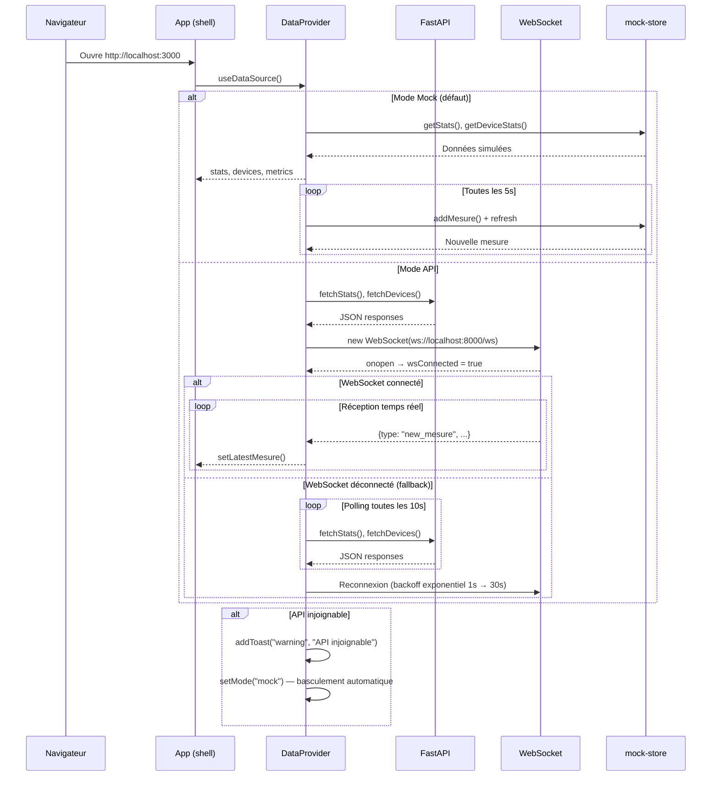

# Diagramme UML — Séquence : Chargement du Dashboard

Du chargement initial à la réception des données en temps réel, avec fallback automatique.

## Modes de fonctionnement

| Mode | Source | Intervalle | Latence |
|------|--------|-----------|---------|
| **Mock** | `mock-store.ts` (local) | 5s (polling simulé) | ~0 ms |
| **API + WebSocket** | FastAPI + WS push | Temps réel | < 500 ms |
| **API + Polling** | FastAPI REST | 10s (fallback) | ~100 ms |
| **Fallback auto** | Mock (après erreur API) | 5s | ~0 ms |
