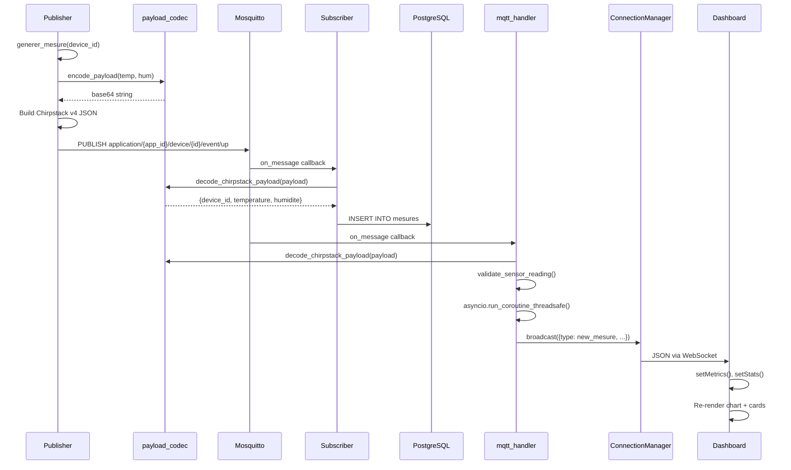

# Diagramme UML — Séquence : Pipeline MQTT complet

De la génération de mesure dans le publisher jusqu'à l'affichage dans le navigateur.

## Points clés

1. **Double consommateur** : Le subscriber (worker autonome) et le mqtt_handler (intégré à FastAPI) écoutent tous deux le broker MQTT
2. **Bridge asyncio** : Le callback MQTT s'exécute dans un thread paho-mqtt. `asyncio.run_coroutine_threadsafe()` permet d'appeler `broadcast()` dans la boucle asyncio de FastAPI
3. **Latence** : De l'étape PUBLISH à l'affichage dans le dashboard, la latence totale est < 500 ms en conditions normales
