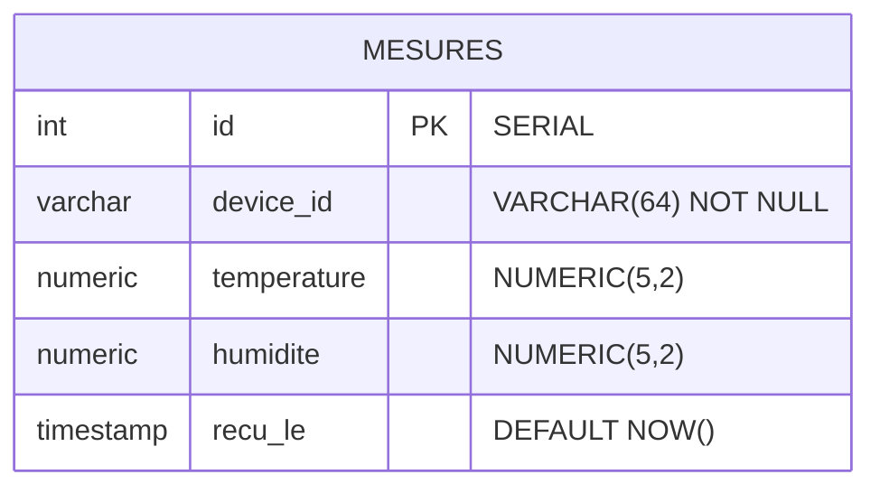

# Schéma base de données

## Diagramme entité-relation



## Table `mesures`

| Colonne | Type | Contrainte | Description |
|---------|------|-----------|-------------|
| id | SERIAL | PRIMARY KEY | Identifiant auto-incrémenté |
| device_id | VARCHAR(64) | NOT NULL | EUI du capteur LoRaWAN |
| temperature | NUMERIC(5,2) | - | Température en °C (-40 à 85) |
| humidite | NUMERIC(5,2) | - | Humidité relative en % (0 à 100) |
| recu_le | TIMESTAMP | DEFAULT NOW() | Horodatage d'insertion |

## Index de performance

| Index | Colonnes | Usage |
|-------|----------|-------|
| idx_mesures_device_id | device_id | Filtrage par capteur |
| idx_mesures_recu_le | recu_le DESC | Requêtes time-series |
| idx_mesures_device_time | device_id, recu_le DESC | Combiné capteur + temps |
| idx_mesures_no_dupes | device_id, recu_le | UNIQUE - Prévient mesures dupliquées pour même capteur/timestamp |

## DDL SQL complet

Le schéma est créé au démarrage du conteneur PostgreSQL via `docker/postgres/init.sql`.

### Table `mesures`

```sql
CREATE TABLE IF NOT EXISTS mesures (
    id          SERIAL PRIMARY KEY,
    device_id   VARCHAR(64) NOT NULL,
    temperature NUMERIC(5,2),
    humidite    NUMERIC(5,2),
    recu_le     TIMESTAMP DEFAULT NOW()
);
```

### Indexes

```sql
CREATE INDEX IF NOT EXISTS idx_mesures_device_id ON mesures(device_id);
CREATE INDEX IF NOT EXISTS idx_mesures_recu_le ON mesures(recu_le DESC);
CREATE INDEX IF NOT EXISTS idx_mesures_device_time ON mesures(device_id, recu_le DESC);
CREATE UNIQUE INDEX IF NOT EXISTS idx_mesures_no_dupes ON mesures(device_id, recu_le);
```

## Fonction de purge

ExploreIOT inclut une fonction PostgreSQL pour la rétention des données :

```sql
CREATE OR REPLACE FUNCTION purge_old_mesures(retention_days INTEGER DEFAULT 90)
RETURNS INTEGER AS $$
DECLARE
    deleted INTEGER;
BEGIN
    DELETE FROM mesures WHERE recu_le < NOW() - (retention_days || ' days')::INTERVAL;
    GET DIAGNOSTICS deleted = ROW_COUNT;
    RETURN deleted;
END;
$$ LANGUAGE plpgsql;
```

Cette fonction supprime les mesures antérieures à `retention_days` jours (par défaut 90). Elle peut être appelée manuellement ou via une tâche cron PostgreSQL (`pg_cron` si disponible).

Usage :
```sql
-- Supprimer les mesures de plus de 90 jours
SELECT purge_old_mesures();

-- Supprimer les mesures de plus de 30 jours
SELECT purge_old_mesures(30);
```

## Volumétrie estimée

### Configuration de simulation

- **Nombre de capteurs** : 3 (simulés par `publisher.py`)
- **Intervalle d'émission** : 5 secondes par capteur
- **Fréquence d'insertion** : 3 capteurs × 1 mesure / 5s = 0,6 mesure/seconde = 2160 mesures/heure

### Croissance des données

| Métrique | Valeur |
|----------|--------|
| Mesures par jour | 51 840 (2160 × 24h) |
| Mesures par mois | 1 555 200 (51840 × 30j) |
| Mesures par an | 18 662 400 (51840 × 365j) |

### Taille disque (sans indexes)

Chaque ligne mesure environ **80 octets** (4 NUMERIC + 1 VARCHAR(64) + 1 TIMESTAMP + overhead ligne) :

| Durée de conservation | Mesures | Taille (sans indexes) |
|----------------------|---------|----------------------|
| 1 jour | 51 840 | ~4 Mo |
| 30 jours | 1 555 200 | ~120 Mo |
| 90 jours | 4 665 600 | ~360 Mo |
| 1 an | 18 662 400 | ~1,4 Go |

Les indexes additionnels ajoutent environ **30-40%** d'espace disque supplémentaire.

## Requêtes principales

ExploreIOT exécute trois types de requêtes sur la table `mesures` :

### 1. Statistiques d'un capteur (dernières 24h)

Utilisée par la section "StatsCards" du dashboard pour afficher min/max/moyenne.

```sql
SELECT
    device_id,
    MIN(temperature) as temp_min,
    MAX(temperature) as temp_max,
    AVG(temperature) as temp_avg,
    MIN(humidite) as hum_min,
    MAX(humidite) as hum_max,
    AVG(humidite) as hum_avg,
    COUNT(*) as nb_mesures
FROM mesures
WHERE device_id = $1 AND recu_le >= NOW() - INTERVAL '24 hours'
GROUP BY device_id;
```

Index utilisé : `idx_mesures_device_time` (device_id + recu_le DESC)

### 2. Statistiques globales (toutes les applications)

Agrégation sur tous les capteurs pour les cartes récapitulatives.

```sql
SELECT
    COUNT(DISTINCT device_id) as nb_capteurs,
    COUNT(*) as nb_total_mesures,
    AVG(temperature) as temp_globale,
    AVG(humidite) as hum_globale
FROM mesures
WHERE recu_le >= NOW() - INTERVAL '24 hours';
```

Index utilisé : `idx_mesures_recu_le` (recu_le DESC)

### 3. Historique paginé d'un capteur

Utilisée par le composant "MetricsChart" pour afficher les séries temporelles.

```sql
SELECT
    id, device_id, temperature, humidite, recu_le
FROM mesures
WHERE device_id = $1 AND recu_le >= NOW() - INTERVAL '7 days'
ORDER BY recu_le DESC
LIMIT $2 OFFSET $3;
```

Index utilisé : `idx_mesures_device_time` (device_id + recu_le DESC)

## Dépendances fonctionnelles

La table `mesures` respecte la **forme normale de Boyce-Codd (FNBC)**, garantissant l'absence d'anomalies d'insertion/suppression/mise à jour.

### Analyse FNBC

| Dépendance | Détail |
|------------|--------|
| `id → {device_id, temperature, humidite, recu_le}` | id est la clé primaire ; tous les autres attributs en dépendent |
| `(device_id, recu_le) → {temperature, humidite}` | Un capteur à un instant donné a une unique mesure |
| Pas de dépendances circulaires | La table ne contient qu'un seul fait métier : "une mesure d'un capteur" |

### Normalisation

- **1NF** ✓ : Tous les attributs sont atomiques (scalaires)
- **2NF** ✓ : Aucun attribut non-clé ne dépend partiellement d'une clé composée
- **3NF** ✓ : Aucun attribut non-clé ne dépend d'un autre attribut non-clé
- **FNBC** ✓ : Chaque déterminant est une clé candidate

## Gestion du schéma

Le schéma est versionné par **Alembic**. La migration initiale est dans `backend/migrations/versions/`.

- Appliquer les migrations : `alembic upgrade head`
- Créer une nouvelle migration : `alembic revision -m "description"`
- Revenir en arrière : `alembic downgrade -1`
- Voir l'historique : `alembic history`

Le fichier `docker/postgres/init.sql` est conservé comme fallback pour les environnements Docker sans Alembic.

!!! tip "Voir aussi"
    - [Architecture — MCD](../../architecture/03-contexte.md#36-modele-conceptuel-de-donnees-merise-mcd) — modèle conceptuel
    - [Architecture — MLD](../../architecture/05-blocs.md#57-modele-logique-de-donnees-merise-mld) — modèle logique
    - [Architecture — MPD](../../architecture/07-deploiement.md#79-modele-physique-de-donnees-merise-mpd) — modèle physique
