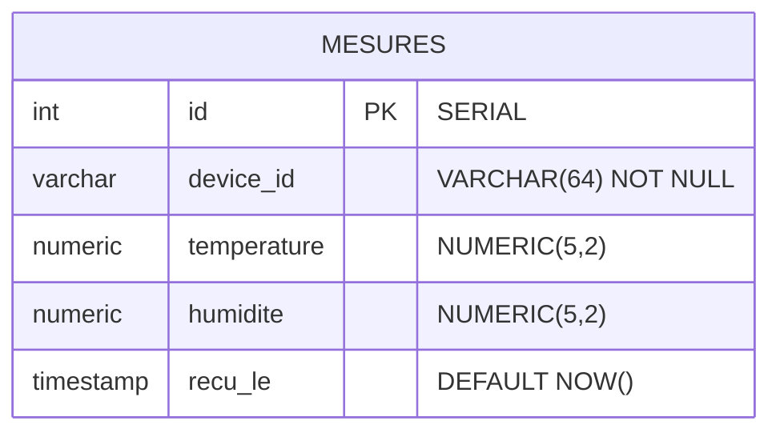

# Schéma base de données

## Diagramme entité-relation

## Table `mesures`

| Colonne | Type | Contrainte | Description |
|---------|------|-----------|-------------|
| id | SERIAL | PRIMARY KEY | Identifiant auto-incrémenté |
| device_id | VARCHAR(64) | NOT NULL | EUI du capteur LoRaWAN |
| temperature | NUMERIC(5,2) | - | Température en °C (-40 à 85) |
| humidite | NUMERIC(5,2) | - | Humidité relative en % (0 à 100) |
| recu_le | TIMESTAMP | DEFAULT NOW() | Horodatage d'insertion |

## Index de performance

| Index | Colonnes | Usage |
|-------|----------|-------|
| idx_mesures_device_id | device_id | Filtrage par capteur |
| idx_mesures_recu_le | recu_le DESC | Requêtes time-series |
| idx_mesures_device_time | device_id, recu_le DESC | Combiné capteur + temps |
| idx_mesures_no_dupes | device_id, recu_le | UNIQUE - Prévient mesures dupliquées pour même capteur/timestamp |

## Gestion du schéma

Le schéma est versionné par **Alembic**. La migration initiale est dans `backend/migrations/versions/`.

- Appliquer les migrations : `alembic upgrade head`
- Créer une nouvelle migration : `alembic revision -m "description"`
- Revenir en arrière : `alembic downgrade -1`
- Voir l'historique : `alembic history`

Le fichier `docker/postgres/init.sql` est conservé comme fallback pour les environnements Docker sans Alembic.
